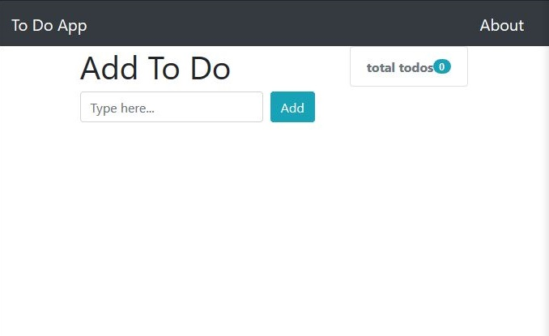
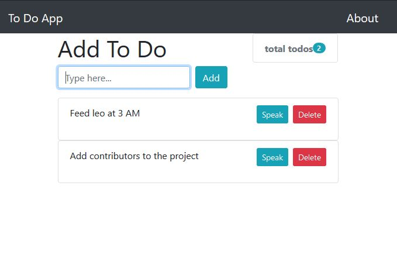

# ToDoApp-Django
ToDoApp is a project based on python django framework, This app is functional and it lets you create your ToDo list, Delete you ToDo list as well as it has functionality to speak contents of ToDo list. This app has been developed using Python, Django framework, HTML, Bootstrap.

## To create a new project
> django-admin startproject project_name

## Start the development server
> python manage.py runserver

## Creating the app
> python manage.py startapp app_name

## Creating necessary database tables
> python manage.py migrate

## Telling Django that you’ve made some changes to your models
> python manage.py makemigrations

## Creating an admin user
> python manage.py createsuperuser

### This is how the app will look after cloning this repository
> 

> 

You can delete your ToDos just by clicking on delete button